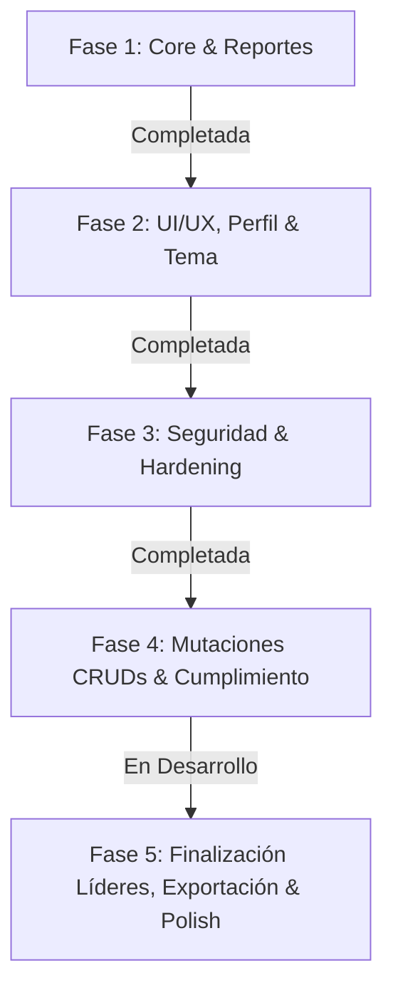

# Requerimientos — Proyecto Vino Nuevo

## Descripción General
Aplicación web de gestión y reportes para un servicio comunitario (ministerio "Vino Nuevo").  
**Stack:** Python Flask + MySQL (PyMySQL) + HTML/CSS/JS (Jinja2)  
**Cobertura y Calidad:** 93 pruebas automatizadas ejecutadas y pasando al 100% (`unittest`).

---

## 1. Estado General de Requerimientos

**Criterio de Evaluación:** Se considera **Implementado (✅)** lo que está conectado a una ruta, servicio, consulta o listener funcional con persistencia en BD y validado por pruebas automatizadas. Lo que cuenta con backend funcional pero le faltan mutaciones o frontend se cataloga como **Parcial (⚠️)**. Lo que no tiene desarrollo se cataloga como **Pendiente (❌)**.

| # | Requerimiento | Estado actual | Evidencia y Trabajo Pendiente |
|---|---|---|---|
| 1 | **INSERT y Guardado de Reportes en BD** | ✅ Implementado | `services/cdp_service.py:process_reporte()` y `db_queries.insertar_reporte()`. Formulario conectado en `POST /lider_cdp/generar_reporte`, con UUID(), invalidación de caché, soporte de ofrendas duales (USD/Bs), cálculo dinámico desacoplado (`generar_reporte.js`) y control transaccional con rollback. |
| 2 | **Edición y Eliminación de Reportes (Líder CDP)** | ✅ Implementado | Modales funcionales en `index.html` con endpoints `POST /lider_cdp/reporte/<id>/editar` y `POST /lider_cdp/reporte/<id>/eliminar`, control de permisos por CDP y confirmación. |
| 3 | **Script de Poblado y Test Data** | ✅ Implementado | `insert_test_data.py` con soporte para SSL en BD remota (Aiven/Cloud), dotenv, generación de UUIDs, hashes Werkzeug y 8 semanas de reportes históricos e idempotencia. |
| 4 | **Dashboard con Datos Reales y Caché** | ✅ Cumplido | `dashboard_service.py` y `db_queries.py` con métricas jerárquicas (General, Red, CDP), ranking de redes, distribución de asistencia, estados vacíos y caché en memoria con invalidación inteligente. |
| 5 | **Filtros de Reportes (Admin & Supervisor)** | ✅ Implementado | Búsqueda por texto libre, red, Casa de Paz y rango de fechas (`fecha_desde`, `fecha_hasta`) en vistas de administración y supervisión regional. |
| 6 | **Paginación Real Server-Side** | ✅ Implementado | Paginación con ventana deslizante (±2 páginas) y puntos suspensivos en **Reportes**, **Usuarios**, **Líderes** y en el historial del **Dashboard de Líder CDP**. |
| 7 | **Vistas de Supervisor Aisladas por Red** | ✅ Implementado | Dashboard, Estructura, Reportes y Directorio de Líderes con filtrado y aislamiento estricto por la red asignada al supervisor autenticado. |
| 8 | **Vista de Detalle de Casa de Paz** | ✅ Implementado | Rutas `/admin/casa_de_paz/<id>` y `/supervisor/casa_de_paz/<id>` con `detalles_cdp.html`. Muestra cuenta de usuario del sistema (`@username`), botón de gestión directa de credenciales, teléfono propio de la casa con llamadas y WhatsApp directo, equipo ministerial y badge dinámico de cumplimiento semanal (7 días). |
| 9 | **Módulo de Perfil y Credenciales** | ✅ Implementado | Perfil unificado en Admin, Supervisor y Líder CDP con cambio de nombre de usuario, cambio de contraseña con verificación de clave actual, indicador de fortaleza y hash Werkzeug. |
| 10 | **Conectividad Resiliente con Circuit Breaker & Scoped Connection** | ✅ Implementado | `database.py` con `_RequestScopedConnection` (reutilización de socket SSL/TCP por ciclo de vida de petición), circuit breaker con reintentos configurables y limpieza en `teardown_appcontext`. Fallback transparente a modo demo cuando la base de datos externa no está disponible. |
| 11 | **Modo Oscuro Global** | ✅ Implementado | Variable `data-theme="dark"`, persistencia en `localStorage`, inicializador centralizado anti-FOUC (`theme_init.js`) y selectores de tema accesibles en login y perfil. |
| 12 | **Flash Messages y Notificaciones Toast** | ✅ Implementado | Script desacoplado `static/scripts/toast.js` con auto-dismiss (5s), animación de desvanecimiento, categorías semánticas (`success`, `danger`, `warning`, `info`) e iconos contextuales en `admin_layout.html` y `admin_form_layout.html`. |
| 13 | **Páginas de Error Personalizadas** | ✅ Implementado | Plantillas de error 400, 403, 404, 429 (Rate Limit excedido) y 500 (Error interno) estilizadas bajo el design system, con soporte de modo oscuro y botones de retorno contextual. |
| 14 | **CRUD de Usuarios (Mutaciones POST)** | ✅ Implementado | Rutas `POST /admin/usuario/crear` y `POST /admin/usuario/<id>/editar` completadas con validación segura (`utils/validators`), hasheo Werkzeug, verificación de unicidad, actualización de datos personales/contraseña y asignación ministerial dinámica y bidireccional (`red_id` para supervisores, `cdp_id` para líderes). <br>**Falta:** Eliminación segura / baja lógica (`POST /admin/usuario/<id>/eliminar`). |
| 15 | **CRUD de Casas de Paz (Mutaciones POST y Baja Defensiva)** | ✅ Implementado | Rutas `POST /admin/casa_de_paz/crear`, `POST /admin/casa_de_paz/<id>/editar` y `POST /admin/casa_de_paz/<id>/eliminar` conectadas con cobertura de pruebas completa (`tests/test_cdp_crud.py`). <br>• **Creación dual:** Permite crear un nuevo usuario líder o asignar uno existente disponible (`modo_usuario: 'nuevo' \| 'existente'`). <br>• **Edición:** Modificación física y organizativa, reasignación de red, actualización de credenciales o reasignación de usuario líder. <br>• **Baja Defensiva (`eliminar_pausar_cdp`):** Bloquea la baja si tiene líderes asignados (exige reasignación); aplica soft-delete (`is_active = 0`) si tiene reportes históricos para proteger estadísticas; y ejecuta eliminación física limpia permanente si no tiene dependencias. |
| 16 | **CRUD de Redes (Mutaciones POST y Estado)** | ✅ Implementado | Rutas `POST /admin/red/crear`, `/admin/red/<id>/editar`, `/admin/red/<id>/toggle_estado` y `/admin/red/<id>/eliminar` conectadas y funcionales. Validación de nombres con regex, asignación/desvinculación de supervisor, alternancia activa/pausada con insignias dinámicas, invalidación de caché y eliminación protegida sin huérfanos. |
| 17 | **CRUD de Líderes (Mutaciones POST)** | ⚠️ Parcial | **Lectura, filtros por red/CDP, paginación y eliminación completados.** Ruta `POST /admin/lider/<id>/eliminar` conectada con modal accesible de confirmación que exige escribir "ELIMINAR" para desbloquear el botón (`static/scripts/admin/lider.js`). <br>**Falta:** Conectar rutas `POST /admin/lider/crear` y `/admin/lider/<id>/editar` para registrar o modificar líderes/sublíderes con validación de teléfono y asignación a Casa de Paz. |
| 18 | **Búsqueda Client-Side en Tiempo Real** | ⚠️ Parcial | **Completado en la vista de Estructura** (`static/scripts/estructura.js`): Búsqueda instantánea en vivo por código, líder, anfitrión y zona en `#casasSearchInput` sin recarga, además de filtrado dinámico por estado de cumplimiento semanal. <br>**Falta:** Extender el filtrado instantáneo en vivo a las tablas de Usuarios y Líderes. |
| 19 | **Monitoreo de Cumplimiento Semanal de Reportes (7 días)** | ✅ Implementado | `check_cdp_reporte_7d()` y `get_casas_sin_reporte_7d()`. Banner interactivo en la vista de Estructura con contador dinámico por red seleccionada, botón de filtro rápido ("Ver pendientes" / "Ver todas"), notificación flotante toast al cargar la página (con control por sesión `sessionStorage`), badges de pendientes en el panel lateral de redes e insignias visuales ("Al día" vs "Sin reporte" vs "Pausada") en tarjetas y vista de detalles. |
| 20 | **Modularización de Scripts JS y Desacoplamiento CSP** | ✅ Implementado | Extracción de scripts inline a módulos externos en `static/scripts/`: `theme_init.js` (anti-FOUC), `toast.js` (notificaciones), `login.js` (toggle de visibilidad y tema), `generar_reporte.js` (cálculos de asistencia y duración), `admin/form_cdp.js`, `admin/form_redes.js`, `admin/form_usuario.js` y `admin/lider.js`. |
| 21 | **Integración de Contacto por WhatsApp** | ⚠️ Parcial | Enlaces `wa.me` generados con normalización y compatibilidad en detalles de CDP, directorio de líderes y tarjetas de estructura. <br>**Falta:** Normalización estricta de códigos telefónicos internacionales en formularios de edición restantes. |
| 22 | **Exportación a PDF y Excel** | ❌ Pendiente | Botones visuales maquetados en reportes y listados. <br>**Falta:** Implementar generación con ReportLab / openpyxl / CSV en reportes y listados administrativos con filtros aplicados. |

---

## 2. Diagnóstico de Seguridad y Hardening

### 2.1 Estado de Controles de Seguridad

| # | Área de Seguridad | Estado | Nivel de Riesgo | Detalle Técnico |
|---|---|---|---|---|
| 1 | **Protección CSRF** | ✅ **Protegido** | **Bajo** | `Flask-WTF` activo con `CSRFProtect(app)` y tokens `{{ csrf_token() }}` inyectados en todos los formularios, modales POST y llamadas dinámicas. |
| 2 | **Rate Limiting en Autenticación** | ✅ **Protegido** | **Bajo** | `Flask-Limiter` activo limitando intentos en `POST /iniciar_sesion` (5 intentos por minuto) y límites globales anti-DoS, con plantilla de error personalizada `429.html`. |
| 3 | **Autenticación en Endpoint API** | ✅ **Protegido** | **Bajo** | Ruta `/api/dashboard/datos` protegida con `@login_required`, `@role_required` y aislamiento estricto de red para supervisores (IDOR prevenido). |
| 4 | **Cabeceras de Seguridad HTTP** | ✅ **Protegido** | **Bajo** | Inyección global en `after_request`: `X-Frame-Options: SAMEORIGIN`, `X-Content-Type-Options: nosniff`, `Content-Security-Policy` (CSP), `Referrer-Policy` y `Permissions-Policy`. |
| 5 | **Hardening de Cookies de Sesión** | ✅ **Protegido** | **Bajo** | `SESSION_COOKIE_HTTPONLY=True`, `SESSION_COOKIE_SAMESITE='Lax'`, `SESSION_COOKIE_SECURE` y `PERMANENT_SESSION_LIFETIME=timedelta(hours=2)`. |
| 6 | **Validación y Sanitización Server-Side** | ✅ **Protegido** | **Bajo** | Módulo centralizado `utils/validators.py`: validación de tipos, rangos numéricos, coherencia horaria, teléfonos con formato E.164 y sanitización XSS (`markupsafe.escape`). |
| 7 | **Política de Complejidad de Contraseñas** | ✅ **Protegido** | **Bajo** | `validate_password_strength` exige mínimo 8 caracteres, al menos una mayúscula, una minúscula y un número en creación/edición de usuarios y CDPs. |
| 8 | **Gestión de Sesión en Logout & Fixation** | ✅ **Protegido** | **Bajo** | `session.clear()` en logout y regeneración/limpieza previa de sesión en login para neutralizar fijación de sesión. |
| 9 | **Hasheo de Contraseñas** | ✅ **Protegido** | **Bajo** | Implementado con Werkzeug `generate_password_hash` (`pbkdf2:sha256`), verificación segura y migración automática transparente de claves legacy. |
| 10 | **Inyección SQL** | ✅ **Protegido** | **Bajo** | Todas las consultas en `db_queries.py` y servicios utilizan consultas parametrizadas `%s` con tuplas. |
| 11 | **Control de Acceso Basado en Roles (RBAC)** | ✅ **Protegido** | **Bajo** | Decoradores `@login_required`, `@role_required("admin", "supervisor", "lider_cdp")` y validación de pertenencia territorial activa en vistas y API. |
| 12 | **Desacoplamiento de Scripts JS (CSP Compliance)** | ✅ **Protegido** | **Bajo** | Eliminación de scripts JavaScript inline en layouts y templates, reduciendo la superficie de ataque XSS y habilitando directivas CSP estrictas sin `unsafe-inline`. |
| 13 | **Manejo Centralizado de Errores HTTP** | ✅ **Protegido** | **Bajo** | Handlers dedicados en `app.py` para códigos 400, 403, 404, 429 y 500, evitando divulgación de trazas de error (`stack traces`) al cliente. |

---

## 3. Estado de la Base de Datos (`serv_comunitario`)

El esquema relacional activo y verificado en MySQL:

```sql
-- Tabla: usuario
CREATE TABLE `usuario` (
  `id` char(36) NOT NULL DEFAULT uuid(),
  `username` varchar(30) NOT NULL,
  `password` varchar(255) NOT NULL,
  `tipo_usuario` enum('admin','supervisor','lider_cdp') NOT NULL,
  `is_active` tinyint(1) NOT NULL DEFAULT 1,
  `nombre` varchar(30) NOT NULL,
  `apellido` varchar(30) NOT NULL,
  PRIMARY KEY (`id`),
  UNIQUE KEY `username` (`username`)
) ENGINE=InnoDB DEFAULT CHARSET=utf8mb4 COLLATE=utf8mb4_general_ci;

-- Tabla: red
CREATE TABLE `red` (
  `id` int(11) NOT NULL AUTO_INCREMENT,
  `nombre` varchar(50) NOT NULL,
  `is_active` tinyint(1) NOT NULL DEFAULT 1,
  `supervisor_id` char(36) DEFAULT NULL,
  PRIMARY KEY (`id`),
  UNIQUE KEY `uq_red_supervisor` (`supervisor_id`),
  CONSTRAINT `fk_red_supervisor` FOREIGN KEY (`supervisor_id`) REFERENCES `usuario` (`id`) ON DELETE SET NULL ON UPDATE CASCADE
) ENGINE=InnoDB DEFAULT CHARSET=utf8mb4 COLLATE=utf8mb4_general_ci;

-- Tabla: cdp (Casa de Paz)
CREATE TABLE `cdp` (
  `id` int(11) NOT NULL AUTO_INCREMENT,
  `codigo` varchar(30) NOT NULL,
  `anfitrion` varchar(30) NOT NULL,
  `telefono` varchar(15) DEFAULT NULL,
  `direccion` varchar(100) NOT NULL,
  `is_active` tinyint(1) NOT NULL DEFAULT 1,
  `red_id` int(11) NOT NULL,
  `usuario_id` char(36) DEFAULT NULL,
  PRIMARY KEY (`id`),
  UNIQUE KEY `codigo` (`codigo`),
  UNIQUE KEY `usuario_id` (`usuario_id`),
  KEY `fk_cdp_red` (`red_id`),
  CONSTRAINT `fk_cdp_red` FOREIGN KEY (`red_id`) REFERENCES `red` (`id`) ON UPDATE CASCADE,
  CONSTRAINT `fk_cdp_usuario` FOREIGN KEY (`usuario_id`) REFERENCES `usuario` (`id`) ON DELETE SET NULL ON UPDATE CASCADE
) ENGINE=InnoDB DEFAULT CHARSET=utf8mb4 COLLATE=utf8mb4_general_ci;

-- Tabla: lider
CREATE TABLE `lider` (
  `id` int(11) NOT NULL AUTO_INCREMENT,
  `nombre` varchar(30) NOT NULL,
  `apellido` varchar(30) NOT NULL,
  `rol` enum('Lider','Sublider') NOT NULL,
  `telefono` varchar(15) DEFAULT NULL,
  `is_active` tinyint(1) NOT NULL DEFAULT 1,
  `cdp_id` int(11) NOT NULL,
  PRIMARY KEY (`id`),
  KEY `fk_lider_cdp` (`cdp_id`),
  CONSTRAINT `fk_lider_cdp` FOREIGN KEY (`cdp_id`) REFERENCES `cdp` (`id`) ON DELETE CASCADE ON UPDATE CASCADE
) ENGINE=InnoDB DEFAULT CHARSET=utf8mb4 COLLATE=utf8mb4_general_ci;

-- Tabla: reporte
CREATE TABLE `reporte` (
  `id` char(36) NOT NULL DEFAULT uuid(),
  `nro_niños` int(11) NOT NULL DEFAULT 0,
  `nro_regulares` int(11) NOT NULL DEFAULT 0,
  `nro_visitas` int(11) NOT NULL DEFAULT 0,
  `nro_comprometidos` int(11) NOT NULL DEFAULT 0,
  `reconciliaciones` int(11) NOT NULL DEFAULT 0,
  `confesiones` int(11) NOT NULL DEFAULT 0,
  `cesta_amor` tinyint(1) DEFAULT 0,
  `fecha` date DEFAULT curdate(),
  `hr_inicio` time NOT NULL,
  `hr_fin` time NOT NULL,
  `tema` varchar(100) NOT NULL,
  `observaciones` text DEFAULT NULL,
  `ofrendas_usd` decimal(10,2) NOT NULL DEFAULT 0.00,
  `ofrendas_bs` decimal(10,2) NOT NULL DEFAULT 0.00,
  `cdp_id` int(11) NOT NULL,
  `enviado_por_lider_id` int(11) DEFAULT NULL,
  PRIMARY KEY (`id`),
  KEY `fk_reporte_cdp` (`cdp_id`),
  KEY `fk_reporte_lider` (`enviado_por_lider_id`),
  CONSTRAINT `fk_reporte_cdp` FOREIGN KEY (`cdp_id`) REFERENCES `cdp` (`id`) ON DELETE CASCADE ON UPDATE CASCADE,
  CONSTRAINT `fk_reporte_lider` FOREIGN KEY (`enviado_por_lider_id`) REFERENCES `lider` (`id`) ON DELETE SET NULL ON UPDATE CASCADE
) ENGINE=InnoDB DEFAULT CHARSET=utf8mb4 COLLATE=utf8mb4_general_ci;
```

---

## 4. Priorización y Roadmap de Desarrollo



### ✅ Fase 1 — Núcleo, Reportes y Datos (Completada)
- [x] Conexión centralizada a base de datos con Circuit Breaker, soporte SSL y reutilización por contexto de petición (`_RequestScopedConnection`).
- [x] Conexión completa de la planilla de reportes (`POST /lider_cdp/generar_reporte`) con persistencia en MySQL y soporte de ofrendas duales USD/Bs.
- [x] Gestión de reportes para Líder CDP: listado, modales de edición (`/reporte/<id>/editar`) y eliminación (`/reporte/<id>/eliminar`).
- [x] Script `insert_test_data.py` automatizado con hashes Werkzeug, soporte `.env` y SSL.
- [x] Dashboard dinámico multi-nivel con métricas jerárquicas, tarjetas interactivas y caché con invalidación.
- [x] Directorios de lectura de Usuarios, Líderes y Reportes con filtros combinados y paginación con ventana deslizante.
- [x] Vista detallada de Casa de Paz (`/admin/casa_de_paz/<id>` y `/supervisor/casa_de_paz/<id>`).

### ✅ Fase 2 — UI/UX, Perfil y Tema Oscuro (Completada)
- [x] Autenticación rediseñada con toggle de visibilidad de contraseña y selector de tema accesible (`login.js`).
- [x] Módulo de Perfil para todos los roles con actualización de usuario y cambio de contraseña con validación de clave actual.
- [x] Modo oscuro global mediante CSS variables (`data-theme="dark"`), persistencia y prevención anti-FOUC (`theme_init.js`).
- [x] Toasts y notificaciones contextuales integradas en layouts base con auto-dismiss (`toast.js`).
- [x] Accesibilidad y diseño responsivo optimizado (móviles, tablets y desktop).
- [x] Páginas de error personalizadas 400, 403, 404, 429 y 500 integradas al sistema visual.

### ✅ Fase 3 — Seguridad y Hardening (Completada)
- [x] **Protección CSRF**: Integración de `Flask-WTF` con `CSRFProtect(app)` y tokens `{{ csrf_token() }}` en todos los formularios y modales.
- [x] **Rate Limiting en Login**: `Flask-Limiter` limitando intentos a 5 por minuto por IP con protección global anti-DoS y vista 429.
- [x] **Protección de API**: `@login_required` y verificación de rol en endpoint `/api/dashboard/datos` con aislamiento por red (IDOR prevenido).
- [x] **Cabeceras de Seguridad**: Configuración de CSP, HSTS, `X-Frame-Options: SAMEORIGIN`, `Referrer-Policy: strict-origin-when-cross-origin` y `Permissions-Policy` en `after_request`.
- [x] **Hardening de Cookies y Sesiones**: `SESSION_COOKIE_SECURE`, `SESSION_COOKIE_HTTPONLY`, `SESSION_COOKIE_SAMESITE='Lax'` y `PERMANENT_SESSION_LIFETIME`.
- [x] **Limpieza de Sesiones**: `session.clear()` en `logout` y regeneración/limpieza previa en `login` contra fijación de sesión.
- [x] **Módulo de Validaciones Server-Side**: `utils/validators.py` con validación exhaustiva de formatos telefónicos (E.164), rangos numéricos, coherencia horaria y sanitización XSS.

### ✅ Fase 4 — Mutaciones CRUDs Administrativos, Cumplimiento y Modularización (Completada)
- [x] **CRUD de Usuarios (Creación y Edición POST)**:
  - Ruta `POST /admin/usuario/crear`: validación estricta de nombres, username y fortaleza de contraseña (`validate_password_strength`), hasheo Werkzeug, verificación de unicidad e inserción atómica.
  - Ruta `POST /admin/usuario/<id>/editar`: actualización de datos personales y contraseña opcional con validación de unicidad.
  - Sincronización ministerial bidireccional automática: asignación/desvinculación de red para supervisores (`asignar_supervisor_a_red`) y Casa de Paz para líderes (`asignar_usuario_a_cdp`).
- [x] **CRUD de Redes (POST y Gestión de Estado)**:
  - Rutas `POST /admin/red/crear`, `POST /admin/red/<id>/editar`, `POST /admin/red/<id>/toggle_estado` y `POST /admin/red/<id>/eliminar`.
  - Validación de nombres con regex, asignación de supervisores disponibles, alternancia activa/pausada e invalidación de caché.
  - Eliminación protegida que impide huérfanos validando Casas de Paz asociadas.
- [x] **CRUD de Casas de Paz (Creación, Edición y Baja Defensiva)**:
  - Ruta `POST /admin/casa_de_paz/crear`: asignación en modo dual (creación de usuario nuevo o vinculación de líder disponible `get_lideres_cdp_disponibles_servicio`), validación de unicidad de código y credenciales seguras.
  - Ruta `POST /admin/casa_de_paz/<id>/editar`: actualización física de dirección, teléfono, anfitrión, red y credenciales de acceso vinculadas (`actualizar_cdp_servicio`).
  - Ruta `POST /admin/casa_de_paz/<id>/eliminar` y `db_queries.eliminar_pausar_cdp`:
    1. Bloquea la baja si hay líderes asignados (exige reasignación).
    2. Pausa con soft-delete (`is_active = 0`) en CDP y usuario si hay reportes históricos para proteger estadísticas.
    3. Eliminación física total si no tiene dependencias.
- [x] **Sistema de Cumplimiento de Reportes Semanales (7 días)**:
  - Lógica server-side en `services/cdp_service.py` (`check_cdp_reporte_7d`, `get_casas_sin_reporte_7d`) y métricas en `dashboard_service.py`.
  - Banner interactivo de alerta en `estructura_admin.html` con contador dinámico contextual por red.
  - Filtro interactivo "Ver pendientes" / "Ver todas" con scroll asistido y sincronización con el selector de redes.
  - Notificación toast inicial por sesión (`sessionStorage`) alertando sobre casas sin reporte.
  - Insignias de estado visuales en tarjetas (`AL DÍA`, `SIN REPORTE`, `PAUSADA`) y badges de conteo en el panel lateral de redes.
  - Indicador de estado y días transcurridos en la vista de detalle de la casa (`detalles_cdp.html`).
- [x] **CRUD de Líderes (Baja / Eliminación POST)**:
  - Ruta `POST /admin/lider/<id>/eliminar`: eliminación atómica con manejo de transacción, mensajes flash y redirección.
  - Modal accesible `#deleteModal` con exigencia de escritura explícita de "ELIMINAR" para desbloquear el botón de confirmación (`static/scripts/admin/lider.js`).
- [x] **Refactorización Modular de JavaScript**:
  - Desacoplamiento de todos los scripts inline a archivos externos en `static/scripts/` (`theme_init.js`, `toast.js`, `login.js`, `generar_reporte.js`, `admin/form_cdp.js`, `admin/form_redes.js`, `admin/form_usuario.js`, `admin/lider.js`).
- [x] **Búsqueda Client-Side en Estructura**:
  - Filtrado instantáneo en vivo sin recarga por código, líder, anfitrión y zona (`static/scripts/estructura.js`).
- [x] **Batería de Pruebas Automatizadas**:
  - 93 tests unitarios y de integración pasando al 100% (`test_cdp_crud.py`, `test_supervisor_and_cascading.py`, `test_red_toggle_estado.py`, `test_security_csrf_headers.py`, `test_lider_cdp.py`, `test_mock_and_circuit_breaker.py`, `test_perfil.py`).

### ⏳ Fase 5 — Finalización de Líderes, Exportación y Polish Final
- [ ] **CRUD de Líderes (Creación y Edición POST)**:
  - Conectar ruta `POST /admin/lider/crear`: validación de nombres, teléfono con formato E.164 (+58), selección de rol (`Lider` o `Sublider`) y vinculación obligatoria a `cdp_id`.
  - Conectar ruta `POST /admin/lider/<id>/editar`: modificación de datos de contacto, rol y reasignación de Casa de Paz.
- [ ] **Baja Lógica de Usuarios**:
  - Conectar ruta `POST /admin/usuario/<id>/eliminar` para baja lógica (`is_active = 0`) o eliminación segura.
- [ ] **Búsqueda Instantánea Client-Side en Tablas**:
  - Extender el filtrado reactivo sin recarga a las tablas de Usuarios (`usuarios_admin.html`) y Líderes (`lider_admin.html`).
- [ ] **Generación de Reportes PDF/Excel**:
  - Exportación de reportes filtrados a PDF con resumen de asistencia y ofrendas.
  - Exportación de listados de usuarios, líderes y Casas de Paz a Excel (`.xlsx` o `.csv`).
- [ ] **Preparación Final para Producción**:
  - Asegurar `DEBUG=False`, variables de entorno obligatorias y desactivación del fallback demo en entornos productivos.
